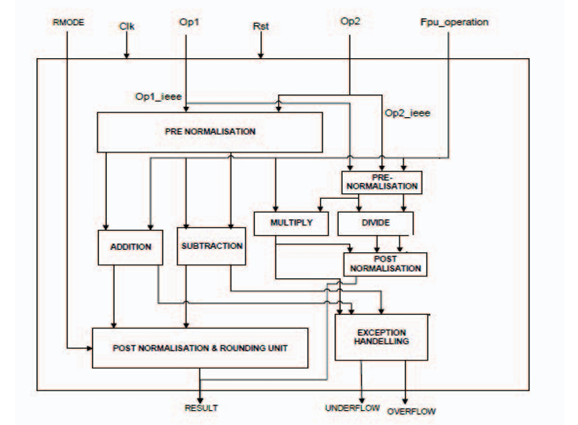
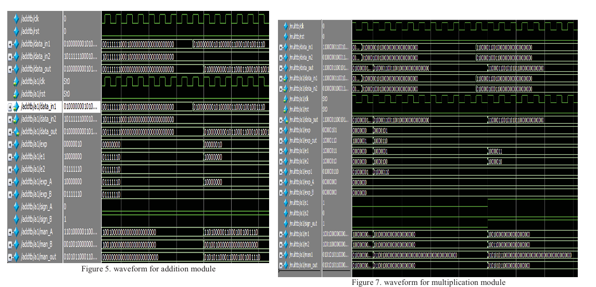
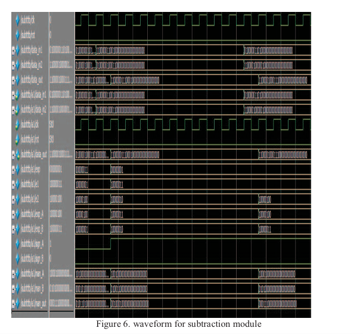
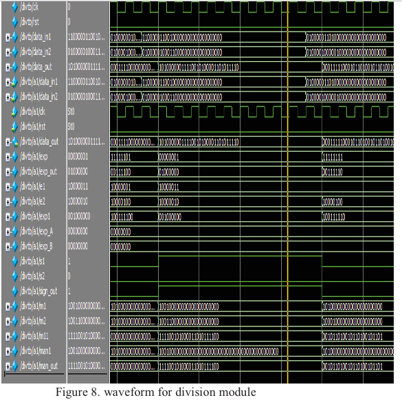
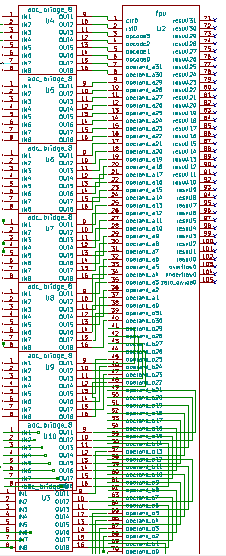
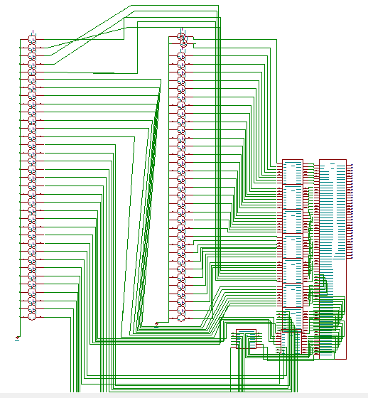

# Design of single precision floating point unit using esim 
 * [Abstract](#abstract)
  * [Reference Circuit Details](#reference-circuit-details)
  * [Reference Circuit Diagram](#reference-circuit-diagram)
  * [Reference Circuit Waveform](#reference-circuit-waveform)
   - [Simulation in esim](#simulation-in-esim)
  * [Schematic](#schematic)
  * [Parameters set for clk](#parameters-set-for-clk)
  * [Parameters set for Voltage Source for Input B](#parameters-set-for-voltage-source-for-input-b)
  * [Transient Settings](#transient-settings)
  * [Netlist](#netlist)
  * [Waveform](#waveform)
## Abstract
Floating point numbers are used in many applications such as telecommunications, medical imagining, radar, etc. In top-down design approach, four arithmetic modules, addition, subtraction, multiplication and division are combined to form a floating point ALU unit. Each module is independent to each other. In this paper, the implementation of a floating point ALU is designed and simulated. This paper presents the design of a single precision floating point arithmetic logic unit. The operations are performed on 32-bit operands. The algorithms of addition, subtraction, division and multiplication are modeled in Verilog HDL using ModelSim and an efficient algorithm for addition and subtraction module is developed in order to reduce the no. of gates used. The RTL code is synthesized using Synopsys RTL complier for 180nm TSMC technology with proper constraints.
## Reference Circuit Diagram

## Reference Circuit Details
### This FPU is designed to perform the four basic arithmetic operations (addition, subtraction, multiplication, and division) on floating-point numbers.
## Inputs and Outputs
Inputs:Op1, Op2: The two 32-bit single-precision floating-point numbers (operands) on which the operation will be performed.  
Fpu_operation: A control signal that selects which arithmetic operation to execute (e.g., Add, Subtract, Multiply, or Divide).  
RMODE: (Rounding Mode) A control signal that specifies how the final result should be rounded (e.g., round to nearest, round to zero, etc.).  
Clk: The master clock signal to synchronize the unit's operations.  
Rst: A reset signal to initialize the unit to a known state.  
Outputs:RESULT: The 32-bit floating-point result of the calculation.
UNDERFLOW: An exception flag that is set if the result is too small to be represented.
OVERFLOW: An exception flag that is set if the result is too large to be represented.
Internal Blocks and Data FlowThe circuit operates in several key stages, typical for a floating-point pipeline:Pre-Normalisation:Both operands, Op1 and Op2, first go into PRE NORMALISATION blocks.This stage "unpacks" the 32-bit numbers into their three components: sign, exponent, and mantissa.For addition and subtraction, this block is critical. It compares the exponents of Op1 and Op2 and shifts the mantissa of the smaller number to the right until their exponents are equal. This "alignment" is necessary before adding or subtracting.For multiplication and division, this step might just involve unpacking and checking for special values (like zero or infinity).Arithmetic Operation:The circuit has four separate modules for the core math: ADDITION, SUBTRACTION, MULTIPLY, and DIVIDE.Based on the Fpu_operation control signal, the aligned/unpacked operands are sent to the correct module.Add/Sub Path: The aligned operands go to the ADDITION or SUBTRACTION blocks.Mul/Div Path: The operands go to the MULTIPLY or DIVIDE blocks.Post-Normalisation & Rounding:The "raw" result from the arithmetic operation must be converted back into the standard floating-point format.Post-Normalisation: This step adjusts the result. For example, if the addition result's mantissa has overflowed, it is shifted right, and the exponent is incremented. This process ensures the mantissa is in the correct format (e.g., starting with a "1."). The diagram shows a separate POST NORMALISATION block for the Mul/Div path and a combined unit for the Add/Sub path.Rounding: The (now normalized) result is rounded accordingto the RMODE input signal. This is handled by the POST NORMALISATION & ROUNDING UNIT.The final, packed 32-bit RESULT is output from this block.Exception Handling:The EXCEPTION HANDELLING block monitors the entire process.It receives status signals from the PRE NORMALISATION, POST NORMALISATION, and ROUNDING units.It checks for error conditions, such as:Overflow: The result's exponent is too large (e.g., $10^{50}$).Underflow: The result's exponent is too small (e.g., $10^{-50}$).Other conditions (not shown) could include divide-by-zero or invalid operations (like $\sqrt{-1}$).It then asserts the OVERFLOW or UNDERFLOW output flags accordingly.
## Reference Circuit Waveform

# Simulation in esim
## Schematic

## Parameters set for clk
