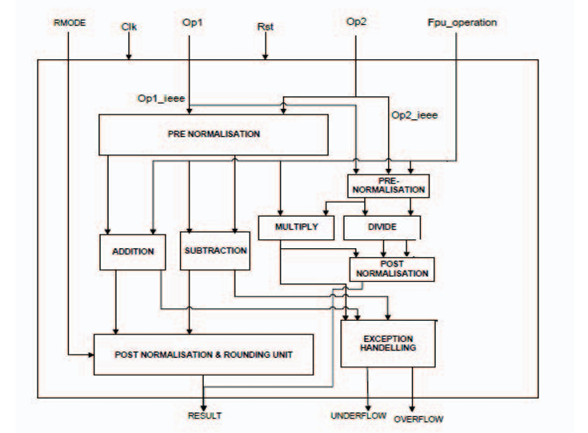

# Design of single precision floating point unit using esim 
 * [Abstract](#abstract)
  * [Reference Circuit Details](#reference-circuit-details)
  * [Reference Circuit Diagram](#reference-circuit-diagram)
  * [Reference Circuit Waveform](#reference-circuit-waveform)
## Abstract
Floating point numbers are used in many applications such as telecommunications, medical imagining, radar, etc. In top-down design approach, four arithmetic modules, addition, subtraction, multiplication and division are combined to form a floating point ALU unit. Each module is independent to each other. In this paper, the implementation of a floating point ALU is designed and simulated. This paper presents the design of a single precision floating point arithmetic logic unit. The operations are performed on 32-bit operands. The algorithms of addition, subtraction, division and multiplication are modeled in Verilog HDL using ModelSim and an efficient algorithm for addition and subtraction module is developed in order to reduce the no. of gates used. The RTL code is synthesized using Synopsys RTL complier for 180nm TSMC technology with proper constraints.
## Reference Circuit Diagram

